This is the coding part of the ViT "series". The coding walkthrough is based on the DINO (GitHub repo)[https://github.com/facebookresearch/dino/blob/main/vision_transformer.py], it won't be exactly identical, the point of this walkthrough is to briefly showcase how the important modules (patch embedding, multi-head attention and the mlp modules) are implemented, therefore I'll exclude dropouts and fancy weight initializations. We will be using PyTorch for this, and obviously, knowing how transformers work is essential for this "tutorial".

Alright, our ViT is basically a number of encoder blocks stacked next (or on top) of each other, our embeddings go through these encoders, and on the other side, we extract the CLS token and use it for whatever downstream task.

This is the anatomy of an encoder block.

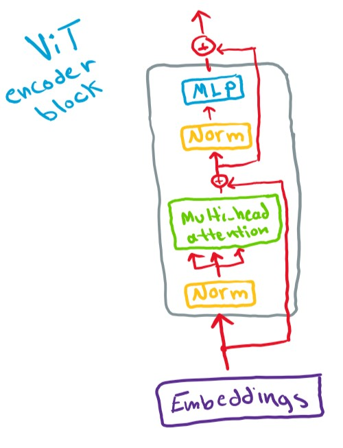

But before getting into the encoder block we need to tokenize our images.

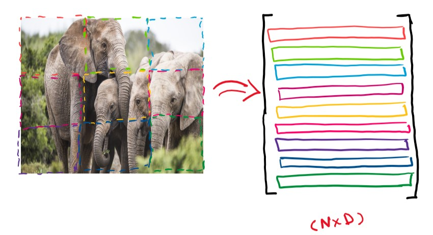

This Module does exactly that, let us break it down.

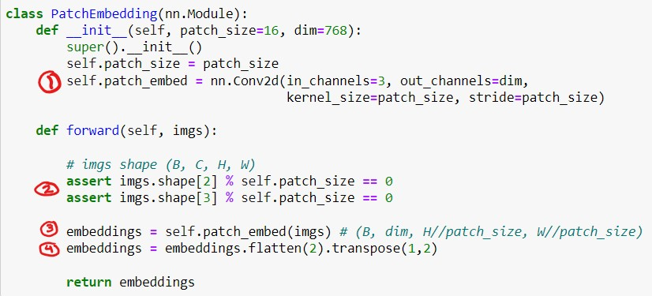

What we expect this module to do is to receive images of shape (B, C, H, W) and turn them into embeddings of shape (B, N, D).

First we set the patch_size, the original ViT used 16 so we set it as the default value. As we mentioned in the previous post, we can cleanly turn our images into sequential tokens using a conv layer with the following parameters

<code>nn.Conv2d(in_channels=3, out_channels=dim, 
                                     kernel_size=patch_size, stride=patch_size)</code>

So at (1) we create our conv layer, at (2) we make sure our image's height and width are divisible by the patch_size, at (3) we let our images go through the conv layer, the output is of shape (B, D, H//patch_size, W//patch_size), we want it to be of the shape (B, N, D), so at (4) we flatten our last two dimensions with the <code>flatten</code> method, the flatten method takes the start and end dimensions, if only the start dimension is specified, then the dimensions starting from start_dimensoin till the last dimension will be flattened.

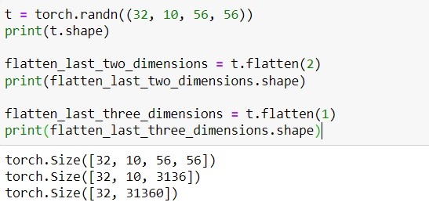

And then we transpose the second and third dimensions (dimensions start from 0 so second means dimension 1) to get our final shape (B, N, D). Important note, sometimes people misuse transpose/permute and reshape/view, it's important to realize that transposing dimensions is different from reshaping the tensors into the desired new shape.

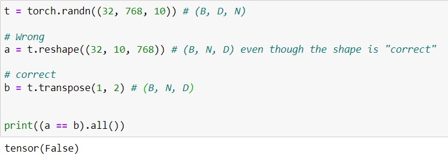

A visual example of the difference between reshaping and transposing

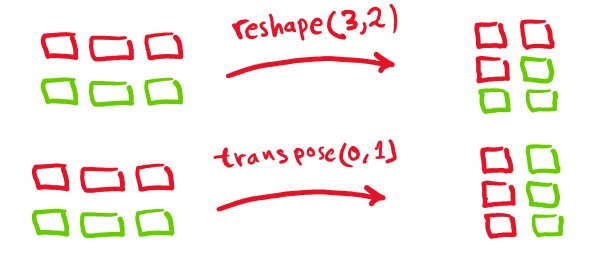

Now our images are turned into sequential tokens, we will deal with the positional embeddings later, now we will move on to the next major module, Multi-head self-attention.

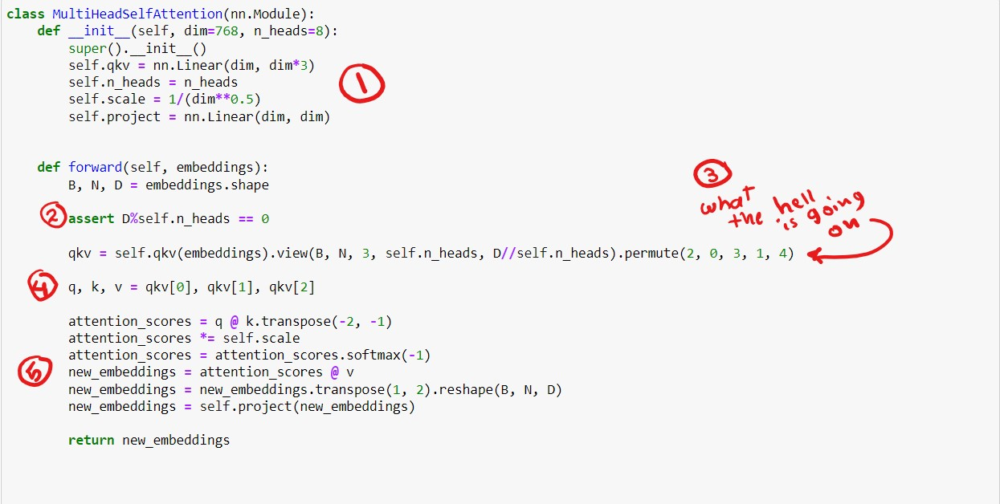

This module performs multi-head self-attention, it's expected inputs are the embeddings of the shape (B, N, D) *Note: it should be N+1 because of the [CLS] token but for the sake of simplicity treat N as the number of patches + CLS token*, at (1) we initialize our Linear layer that projects our embeddings into query, key and value vectors (we do that with a single linear layer instead of three linear layers), we set the number of heads since we are performing multi-head attention, our attention scores are scaled by the <code>self.scale</code> before going through softmax in accordance with the original transformer paper, and finally, we initialize the final Linear layer that projects the concatenated value vectors from each head into one single vector.

At (2) we make sure our embeddings dimensions are divisible by the number of heads, otherwise, we won't be able to break down the query, key and value vectors into n_heads query, n_heads key and n_heads value vectors.

(3) is better described with a picture, assume B = 1,  N = 4, n_heads = 3.

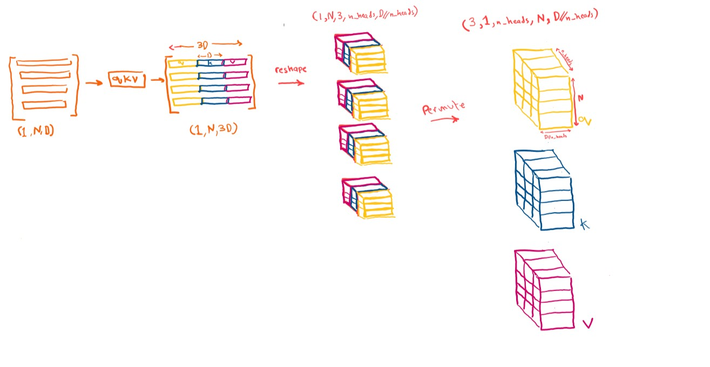

at (4) we unpack the q, k and v tensors (each is of the shape B, n_heahds, N, D//n_heads). (5) we perform self-attention as shown (B=1 and d=D//n_heads in this figure).

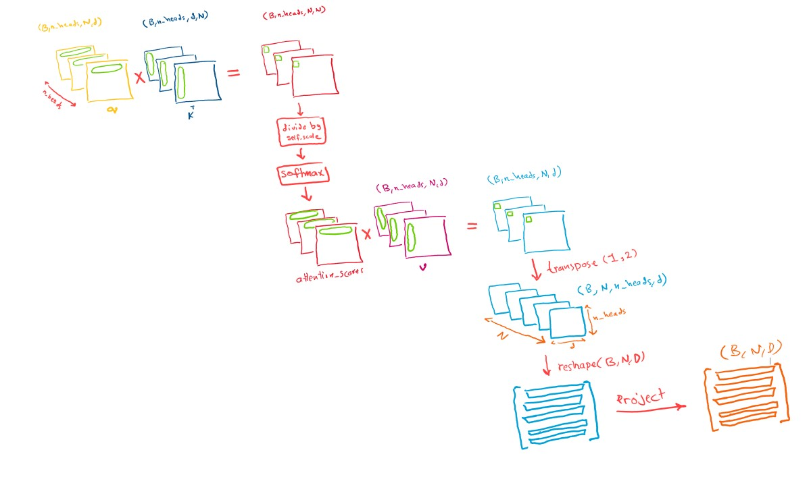

Now we are done with the attention related stuff, the final major module is the MLP module, and it is the easiest.

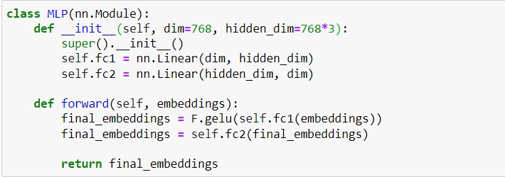

I don't think there is much to be said here, two linear layers with a gelu activation function in between, that's it, simple.

With all our modules ready, we can finally code our encoder block.

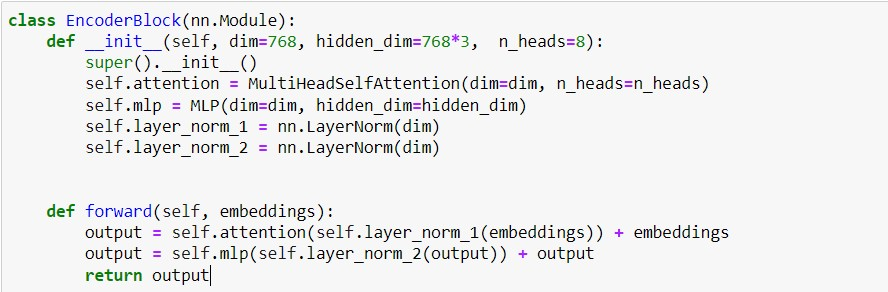

Very straightforward, our embeddings are first normalized, then are fed into the attention layer, and the output is added to the inputs (residual connection), and then normalized again, fed into the mlp, and then the finals outputs are added to the mlp inputs (another residual connection), exactly like the very first figure in this article.

We can now finally put all of this together to create our ViT model.

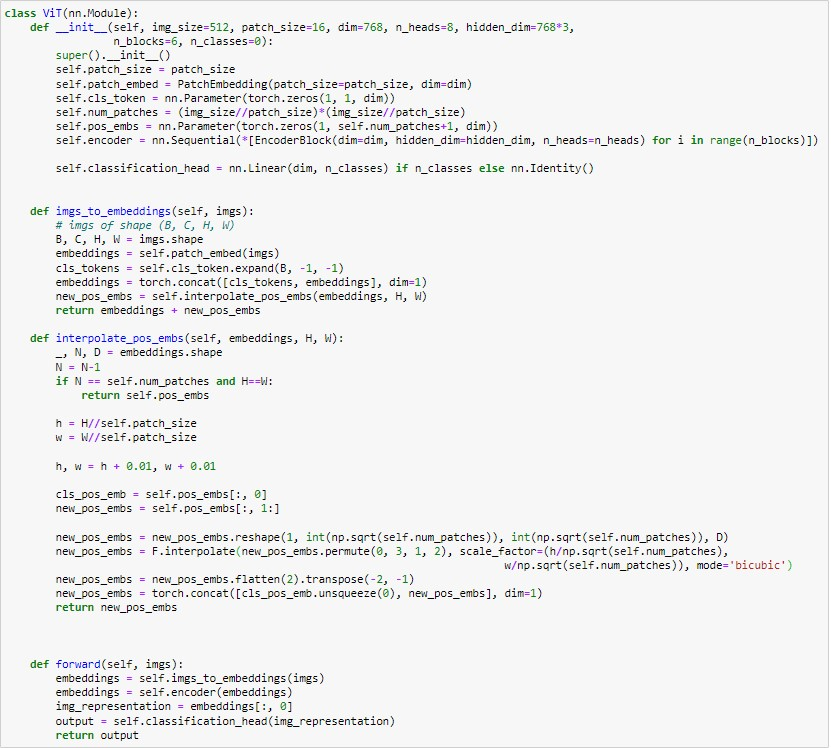

We initialize everything needed in our init method, our patch_size, path_embedding module, and our encoder blocks. We also initialize our cls_token which will be appended ontop of our embeddings, our positional embeddings are also initialized according to the img_size parameter (assuming we train on 512x512 images, and patch_size of 16, we will have num_patches = 1024 so our positional embeddings will be of size (1024+1, dim)).

the <code>imgs_to_embeddings</code> method prepares images for our encoder blocks, it takes images of shape 
(B, C, H, W) and turns them into embeddings of shape (B, N+1, D). It first uses <code>self.patch_embed</code> module to turn the images into embeddings of shape (B, N, D), then we append our cls_token, to append the token we first need to expand it with the <code>expand</code> method, the -1 in method's parameters means “keep the same dimension”, now our cls_tokens are of shape (B, 1, D) and can be appended on top of our image embeddings to have a final shape of (B, N+1, D). The final embeddings are then added to the positional embeddings, but before adding them directly we need to make sure the positional embeddings have the proper shape (this is discussed in the first part of the ViT series in a more detailed manner). The <code>interpolate_pos_embs</code> method can be understood through these figures

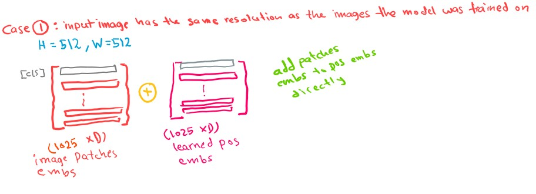
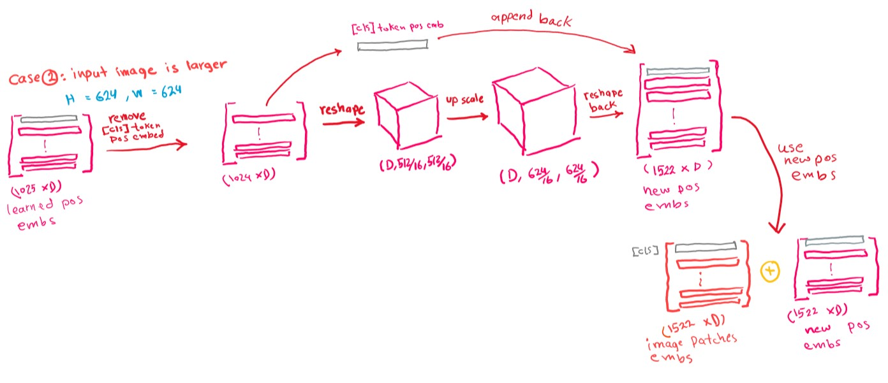
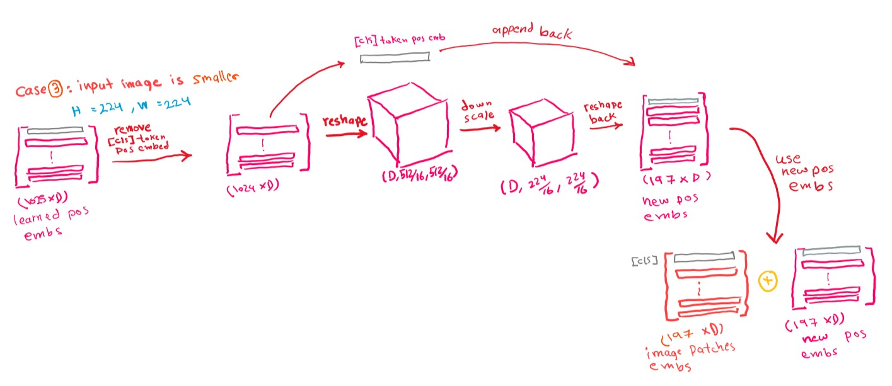

One subtle thing to notice is that we are adding a strange 0.1 to both h and w before interpolating, the reason is discussed in this [issue](https://github.com/facebookresearch/dino/issues/8) (in short it is just to avoid floating-point errors).

Once we are done with the interpolation, the new positional_embeddings can be added to the image embeddings, and our inputs now are ready to go through the encoder blocks.

The <code>forward</code> method receives the embeddings and passes them through the encoder blocks, finally, the cls_token is extracted and used for classification (or any other downstream task).

This was a relatively simple introduction to creating your own ViT.

