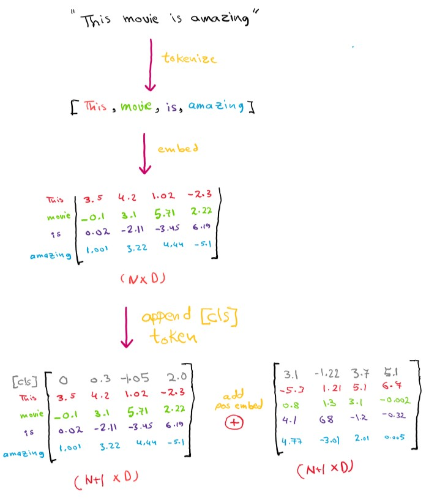
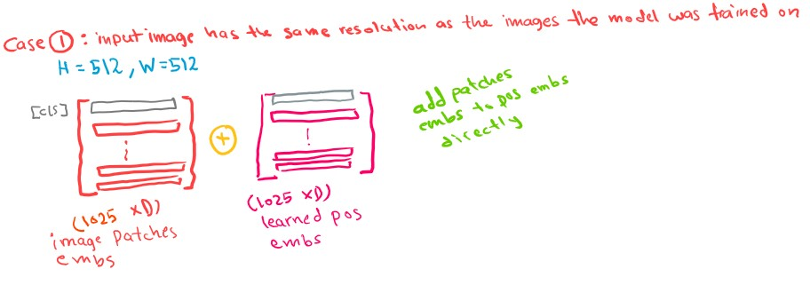
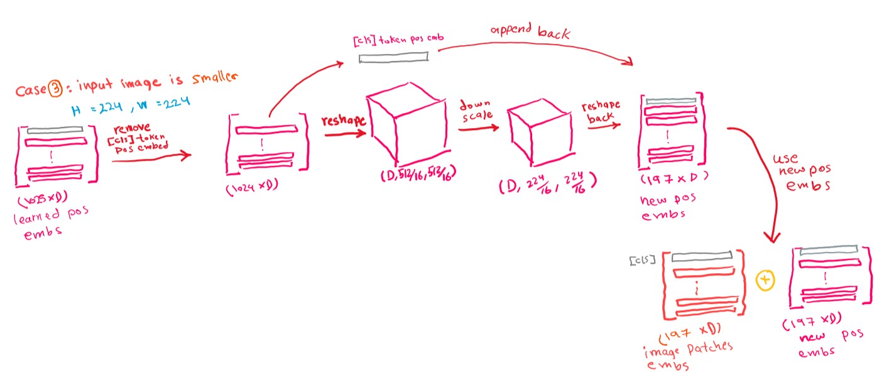

By now anyone who is interested in deep learning should be at least familiar with the word "Transformers", these transformers were born out of the influential paper [Attention is all you need](https://arxiv.org/abs/1706.03762), normally transformers were used for NLP (natural language processing) tasks, and are now the standard for these tasks (instead of RNN based architectures), what this paper suggests is that transformers can be also be used for vision tasks, challenging the long-dominant convolution neural networks.

This paper in a nutshell shows that pure transformer based models can perform on par with state of the art conv nets, when trained or pretrained on large amounts of data (at the writing of this, 8 of the top 10 models on Imagenet are either a combination of transformer + conv models or purely transformer models). *write something on why vit needs lots of data*.

This will be the first post from a two-post series, this post will quickly discuss the vision transformer without any code while the next post will be a coding walkthrough on making a homemade vision transformer (ViT) based on the implementation from the DINO [github repo](https://github.com/facebookresearch/dino/blob/main/vision_transformer.py). Familiarity with transformers and Pytorch are required.

The following figure shows the full transformer architecture.

A full transformer consists of two main types of blocks, the encoder and decoder blocks. The full encoder-decoder architecture is normally used in seq2seq models (models that "translate" one sequence to another, this does not have to be literal translation like language translation, although language translation is one example). Most transformer-based models use either the encoder part or the decoder part, BERT uses the encoder part and is used for tasks such as sentiment analysis, while GPT uses the decoder the part and is used for text generation. ViT uses almost the same architecture as BERT which (as we just mentioned) is based on the encoder part of the transformer.

As mentioned before, transformer models were originally made for sequential data, mainly textual data which are sequential by nature. Now let B be the batch size, N the sequence length, and D the dimension of the token's embedding, then the expected input shape is (B, N+1, D) the +1 comes from the [CLS] token.

The following figure showcases how a simple sentence is prepared before entering a transformer.

First the sentence is tokenized (divided into tokens), each token is then turned into a real valued vector (embeddings), then a special token [CLS] is appended on top of these embeddings as the first token, this special token acts as the vector representation of the sentence (or a vector representation of the image in the case of ViT) that can be used for future downstream tasks like classification, this special token aggregates information about all the words that consist the sentence during the self attention operation, it is initialized as a zero vector with dimensions D and is learned during training. Now to inform the transformer about each token's position in the text, we add a positional vector to each token's embedding, this positional vector holds the information related to the token's position in the sequence, This was not required in RNNs because the tokens were fed sequentially, there are different ways to create the position vectors (also called position embeddings), recent transformers usually treat them as learnable parameters and let the training process determine the most suitable position vector for each token. The output of the previous steps is a a (B, N+1, D) tensor (the figure showcases a single sentence so B=1).

Now we would like to prepare our images in the same way as texts, tokenize it then turn each token to embeddings then append the [CLS] token, issue is, images are not inherently sequential like text so how can we tokenize it? the paper proposes the following, chop the image into PxP patches and treat each patch as a token.

For example, in the previous figure, pretend the image's shape is (3, 48, 48), our patches are P=16, so we can divide the image into 9 16x16 patches, each patch can act as our token, and the image can be views as sequence of patches.

Next, we want to turn these patches (tokens) into embeddings that we can feed into our transformer. First we take each patch (3x16x16) and flatten it, creating a matrix of dimensions (N, P\*P*C) as shown.

After that, these flattened patches are projected from P\*P*C dimensional vectors into D dimensional vectors (using a Linear/Dense layer for example, but there is a better way to do this), and these are the patches embeddings that we will use in our transformer.

So to recap, essentially what we have done is that we turned our image into sequential patches (tokens) and projected each token into it's own embedding.

This process (turning images into patches and projecting these patches into D dimensional vectors) can be cleanly performed with convolutions, we can use a conv layer with the following parameters (output_channels=D, kernel_size=P, stride=P), the output will be of shape (B, D, H//P, W//P), we then reshape it to (B, D, N) and transpose the second and third dimensions into (B, N, D).

We can now append the [CLS] and our final shape is (B, N+1, D)

What's left is to add the positional embeddings, in ViT the positional embeddings are learned, for example if we are training our model on 512x512 images and patch size of 16x16, then we will have N+1 = 1024 + 1 = 1025 (number of patches + [CLS] token), we will create 1025 positional embeddings (one positional vector for each patch/token, initialized as 0 vectors) that will be learned during training. Now the question arises, what if we feed images with varying sizes, smaller or larger than the ones we trained on, for example if we feed a smaller image 224x244, then N+1 = 196 + 1 = 197, if we feed higher resolution images say 624x624, then N + 1 = 1521 + 1 = 1522, while our model only learned 1025 positional vectors because it was trained on images of the size 512x512. The answer is interpolation, use the learned positional embeddings to either create new positional embeddings if the image is larger, or merge existing positional embedding to reduce N if the images are smaller.

Now that we have our inputs ready, everything from now on works exactly the same as if our embeddings were coming from textual and not imagery data. We first go through a simple Normalization Layer, then we get into what makes a transformer interesting, Multi-head self-attention. Self-attention in transformers works this way, each embedding is projected to three different vectors, a "query", "key" and "value" vectors. The terms query, keys and values are just abstractions we use to describe what is going (or think is going on) cleanly. The query vector of each embedding is dotted with every key vector, the resulting scores are normalized through a softmax and are then used to perform a weighted sum of all the value vectors, so in short each patch/token embedding will transform into a weighted sum of the value vectors.

Multi-head self-attention is basically self-attention performed N_HEAD times. Each head has its own q,k,v vectors and performs self-attention with its vectors. Before the final projections all of the weighted value vectors from the N_HEADS are concatenated first, and are then projected.

Another normalization layer comes after that, then the embeddings go through a Multi-layer perceptron with GELU activations, the MLP is made up of two layers, a layer that maps the embeddings from D to a hidden_dimension(typically few times larger than D) and a layer that maps the embeddings back to D, between both layers is a GELU activation function. And this marks the end of a single ViT block. Our inputs go through several of these blocks (anatomy of a single block is shown in a figure at the top) and then the [CLS] token is extracted for future tasks such as classification or object detection. [THIS POST WILL BE UPDATED WITH MORE FIGURES SOON]

[Original ViT paper link](https://arxiv.org/abs/2010.11929)

